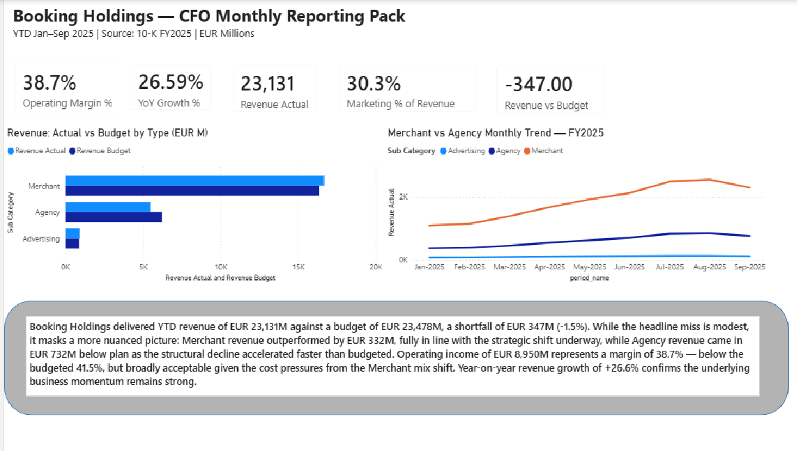
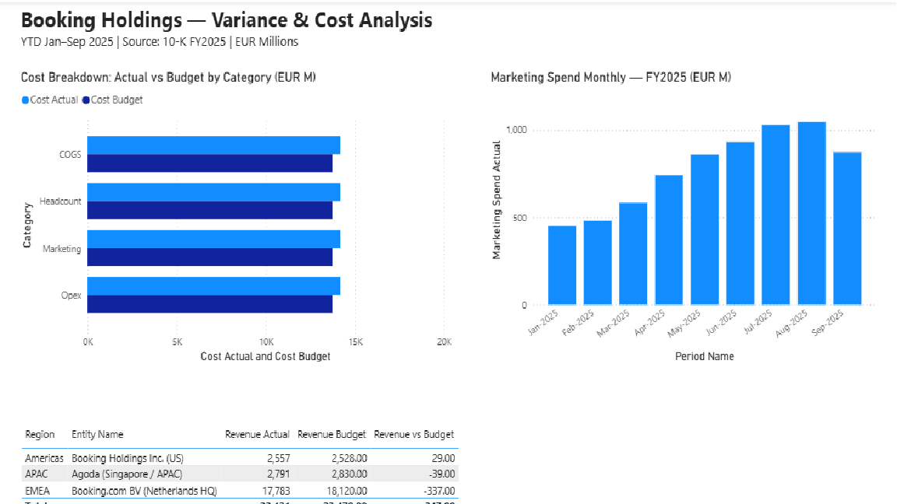

# CFO Monthly Reporting Pack — Booking Holdings (Booking.com)

> An end-to-end automated financial reporting system built on Booking Holdings' real FY2025 financials.  
> Demonstrates finance-led application of SQL, Python, AI, and Power BI — the modern FP&A tech stack.

**Author:** Rahul Gill | CA (All India Rank 39) | Lancaster MBA 2026 | CFA Level II Candidate  
**Data Source:** Booking Holdings 10-K FY2025, SEC EDGAR, filed February 2026  
**Currency:** EUR millions | FX: USD/EUR 1.08 avg 2025  

---

## What This Project Does

Every month, FP&A teams spend days manually compiling the CFO reporting pack — pulling numbers from systems, calculating variances, writing commentary, and building dashboards.

This project automates that entire workflow using real Booking.com financials:

1. **SQL** — Star schema database storing actuals, budget, and prior year across departments, entities, and cost types
2. **Python** — Variance engine that calculates budget vs actual gaps, flags material items, and produces a structured output
3. **AI** — LLM-generated CFO commentary written from the variance data — indistinguishable from a senior analyst's output
4. **Power BI** — Two-page management dashboard with KPI cards, revenue charts, cost analysis, and regional performance

---

## Dashboard Preview

### Page 1 — Executive Summary


### Page 2 — Variance & Cost Analysis


---

## Key Financial Findings (YTD Jan–Sep 2025)

| Metric | Actual | Budget | Variance |
|--------|--------|--------|----------|
| Total Revenue | EUR 23,131M | EUR 23,478M | -EUR 347M (-1.5%) |
| Operating Income | EUR 8,950M | EUR 9,745M | -EUR 795M |
| Operating Margin | 38.7% | 41.5% | -2.8pp |
| Marketing % of Revenue | 30.3% | 28.5% | +1.8pp |
| YoY Revenue Growth | +26.6% | — | — |

**Key story:** Merchant revenue outperformed budget by EUR 332M (+2.0%) as Booking.com's strategic shift from Agency to Merchant accelerates. Agency revenue missed by EUR 732M (-11.7%) — a structural decline, not a demand signal. Marketing overspend of EUR 265M reflects elevated paid search activity in peak Q3 season.

---

## Project Structure

```
cfo-reporting-pack/
│
├── sql/
│   ├── 01_schema.sql          # Star schema: fact_financials + 4 dimension tables
│   ├── 02_dimensions.sql      # Reference data: periods, departments, accounts, entities
│   ├── 03_fact_data.sql       # 384 rows: Actuals, Budget, Prior Year (FY2024-2025)
│   └── 04_kpi_queries.sql     # 5 CFO-grade KPI queries
│
├── python/
│   ├── variance_engine.py     # Reads DB, calculates variances, flags material items
│   ├── ai_commentary.py       # Sends variance data to AI, generates CFO narrative
│   ├── variance_output.json   # Structured variance data (Layer 2 → Layer 3 handoff)
│   └── cfo_commentary.txt     # AI-generated CFO commentary output
│
├── screenshots/
│   ├── page1_executive_summary.png
│   └── page2_variance_analysis.png
│
├── CFO_Reporting_Pack_Booking.pbix   # Power BI dashboard (download to open)
└── cfo_pack_booking.duckdb           # DuckDB database with all financial data
```

---

## How to Run This Project

### Prerequisites
```bash
pip install duckdb pandas google-generativeai
```

### Layer 1 — Query the database
```bash
# Open DuckDB and run KPI queries
python3 -c "
import duckdb
con = duckdb.connect('cfo_pack_booking.duckdb')
result = con.execute('''
    SELECT f.scenario, a.sub_category, ROUND(SUM(f.amount),0) AS eur_millions
    FROM fact_financials f
    JOIN dim_account a ON f.account_id=a.account_id
    JOIN dim_period  p ON f.period_id=p.period_id
    WHERE a.category = 'Revenue' AND p.fiscal_month BETWEEN 1 AND 9
    GROUP BY f.scenario, a.sub_category
    ORDER BY f.scenario, a.sub_category
''').fetchall()
for row in result: print(row)
"
```

### Layer 2 — Run variance engine
```bash
python3 python/variance_engine.py
```

### Layer 3 — Generate AI commentary
```bash
export GEMINI_API_KEY="your-free-key-from-aistudio.google.com"
python3 python/ai_commentary.py
```

### Layer 4 — Open Power BI dashboard
Download `CFO_Reporting_Pack_Booking.pbix` and open in Power BI Desktop (free).

---

## Data Model

Star schema with one fact table and four dimension tables:

- **fact_financials** — 384 rows covering Actual, Budget, Prior Year scenarios
- **dim_period** — 24 periods (FY2024 + FY2025, Jan–Dec)
- **dim_department** — 11 departments (Commercial, Marketing, Ops, G&A)
- **dim_account** — 16 accounts across Revenue, COGS, Marketing, Headcount, Opex
- **dim_entity** — 4 entities (Netherlands HQ, US, Singapore/Agoda, UK)

---

## AI Commentary Sample

> *Booking Holdings delivered YTD revenue of EUR 23,131M against a budget of EUR 23,478M, a shortfall of EUR 347M (-1.5%). While the headline miss is modest, it masks a more nuanced picture: Merchant revenue outperformed by EUR 332M, fully in line with the strategic shift underway, while Agency revenue came in EUR 732M below plan as the structural decline accelerated faster than budgeted. Operating income of EUR 8,950M represents a margin of 38.7% — below the budgeted 41.5%, but broadly acceptable given the cost pressures from the Merchant mix shift. Year-on-year revenue growth of +26.6% confirms the underlying business momentum remains strong.*

---

## Tech Stack

| Layer | Tool | Purpose |
|-------|------|---------|
| Data | DuckDB + SQL | Star schema, KPI queries |
| Analysis | Python + pandas | Variance engine, materiality flagging |
| AI | Google Gemini API | CFO narrative generation |
| Visualisation | Power BI | Management dashboard |
| Version Control | GitHub | Portfolio publishing |

---

## About the Author

Chartered Accountant (All India Rank 39, ICAI) with 5+ years across PwC external audit (financial services, oil & gas) and manufacturing FP&A. Currently completing MBA at Lancaster University Management School (2026). CFA Level II candidate. Targeting FP&A and Finance Controller roles in Amsterdam and Germany.

**LinkedIn:** linkedin.com/in/rahulgill2056  
**GitHub:** github.com/rahulgill-data
